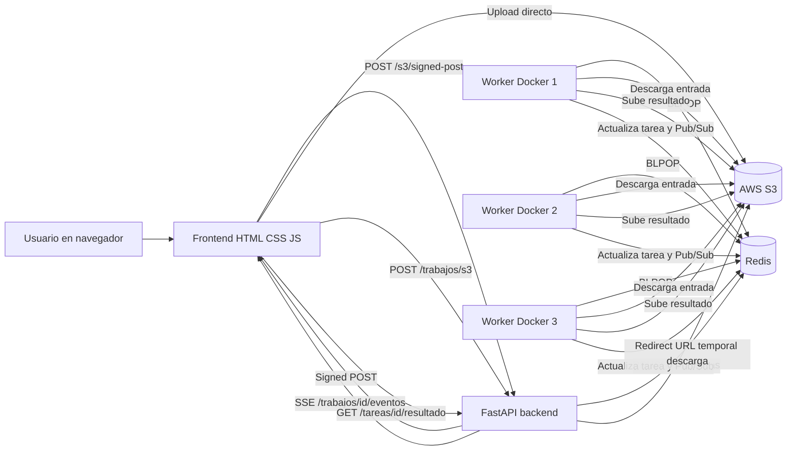
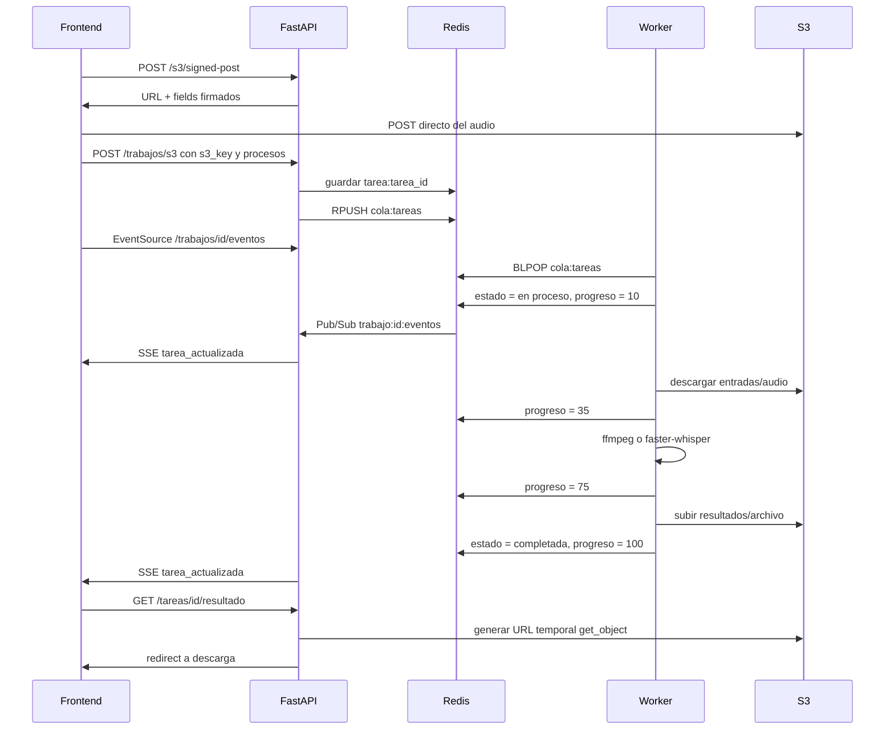

# AudioLab

AudioLab es una aplicación web para subir audio, crear tareas de procesamiento y ejecutarlas en paralelo con workers distribuidos usando Docker, FastAPI, Redis, AWS S3, SSE y JavaScript puro.

El sistema permite:

- Subir audio desde el navegador directamente a AWS S3 usando signed POST.
- Crear un trabajo con varias tareas: transcripción, audio lento, audio rápido, tono grave, tono agudo y onda PNG.
- Encolar tareas en Redis.
- Procesar tareas con múltiples workers Docker.
- Ver estado en tiempo real con SSE.
- Descargar resultados desde S3 con URL temporal.
- Consultar workers activos, logs en vivo, historial local y progreso de cada tarea.

## Evidencias

| Evidencia | Enlace / archivo | 
|---|---|
| URL de funcionamiento y mostrando tareas, workers, resultados y arquitectura| URL Video en Classroom | 
| Repositorio GitHub | [`https://github.com/pepin/AudioLab`]() | 
| Dockerfile backend | [`backend/Dockerfile`](backend/Dockerfile) | 
| Dockerfile worker | [`worker/Dockerfile`](worker/Dockerfile) | 
| Docker Compose | [`docker-compose.yml`](docker-compose.yml) | 
| Explicación de cola | Sección [Redis y cola de mensajes](#redis-y-cola-de-mensajes) | 

## Capturas

| Función | Qué muestra | Captura |
|---|---|---|
| Pantalla principal | Drag & drop, selector de procesos y reproductor de onda |   |
| Trabajo actual | Varias tareas con estados y barras de progreso |  |
| Redis | Cola `cola:tareas` o claves `tarea:*` |  |
| S3 | Carpetas `entradas/` y `resultados/` |  |
| Docker | `docker compose up --scale worker=3` |  |


## Demo rápida


```bash
sudo docker compose up --build --scale worker=3
```

Abrir:

- Frontend: <http://localhost:8080>
- API: <http://localhost:8000>
- Debug Redis: <http://localhost:8000/debug/redis>
- Cola Redis: <http://localhost:8000/debug/cola>

Flujo esperado:

1. Abrir el frontend.
2. Arrastrar o seleccionar un archivo `.wav`, `.mp3`, `.ogg` o `.m4a`.
3. Seleccionar procesos.
4. Enviar el trabajo.
5. Ver tareas en "Trabajo actual".
6. Ver workers tomando tareas en paralelo.
7. Ver barras de progreso y estados en tiempo real.
8. Descargar resultados cuando terminen.

## Arquitectura



## Secuencia de una tarea



## Estructura del repositorio

```text
AudioLab/
├── backend/
│   ├── Dockerfile
│   ├── main.py
│   └── requirements.txt
├── frontend/
│   ├── index.html
│   ├── app.js
│   └── styles.css
├── worker/
│   ├── Dockerfile
│   ├── worker.py
│   └── requirements.txt
└── docker-compose.yml
```

## Tecnologías

| Capa | Tecnología | Uso |
|---|---|---|
| Frontend | HTML, CSS, JavaScript plain | Interfaz, eventos, fetch, DOM, SSE, Canvas, Drag & Drop |
| Backend | FastAPI | API HTTP, SSE, signed POST, Redis, URLs temporales S3 |
| Servidor ASGI | Uvicorn | Ejecutar FastAPI dentro del contenedor |
| Cola | Redis | Lista `cola:tareas`, estado de tareas, logs, workers, Pub/Sub |
| Workers | Python + Docker | Procesamiento distribuido y paralelo |
| Audio | ffmpeg | Cambios de velocidad, tono y onda PNG |
| Transcripción | faster-whisper | Whisper real en CPU con `int8` |
| Storage cloud | AWS S3 | Entradas y resultados |
| Orquestación | Docker Compose | Backend, frontend, Redis y workers |

## Variables de entorno

Archivo `.env` en la raíz del proyecto.

```env
AWS_ACCESS_KEY_ID=ACCESS_KEY
AWS_SECRET_ACCESS_KEY=SECRET_KEY
AWS_SESSION_TOKEN=SESSION_KEY
AWS_REGION=us-east-1
S3_BUCKET=bucket
```

El `docker-compose.yml` también define:

```yaml
REDIS_HOST=redis
REDIS_PORT=6379
MODELO_WHISPER=tiny
```

`MODELO_WHISPER=tiny` usa el modelo más ligero. Para mejor calidad se puede cambiar a:

```yaml
MODELO_WHISPER=base
```

## Instalación y ejecución

### 1. Clonar repositorio

```bash
git clone https://github.com/pepin/AudioLab
cd AudioLab
```

### 2. Crear `.env`

```bash
nano .env
```

Pegar las variables de la sección [Variables de entorno](#variables-de-entorno).

### 3. Levantar todo con un número específico de workers (3)

```bash
sudo docker compose up --build --scale worker=3
```

### 4. Abrir frontend

```text
http://localhost:8080
```

### 5. Ver API

```text
http://localhost:8000
```

### 6. Detener

```bash
Ctrl + C
```

O en otra terminal:

```bash
sudo docker compose down
```

## Puertos

| Servicio | Puerto host | Puerto contenedor | Descripción |
|---|---:|---:|---|
| Frontend nginx | 8080 | 80 | UI web |
| FastAPI backend | 8000 | 8000 | API, SSE y signed URLs |
| Redis | 6379 | 6379 | Cola y estado |

## Frontend

El frontend está hecho con HTML, CSS y JavaScript plain, sin React ni frameworks.

Archivos:

- [`frontend/index.html`](frontend/index.html)
- [`frontend/styles.css`](frontend/styles.css)
- [`frontend/app.js`](frontend/app.js)

Funciones principales:

| Requisito | Implementación |
|---|---|
| Event handlers | Click, change, dragover, dragleave, drop, keydown, resize, timeupdate |
| Fetch a API propia | `/s3/signed-post`, `/trabajos/s3`, `/trabajos`, `/workers`, `/logs` |
| Storage | `localStorage` para historial y trabajos ocultos |
| Modificar DOM | Render dinámico de tareas, workers, logs, historial, botones y métricas |
| Animación | CSS transitions, barras de progreso, estados visuales |
| AWS signed posts | Upload directo a S3 desde navegador |
| Canvas | Onda del audio original como reproductor custom |
| Drag & Drop | Zona de carga de audio |
| SSE | `EventSource` para recibir cambios de tarea en tiempo real |

### Reproductor de onda

La onda del audio original funciona como reproductor:

- Click sobre la onda para reproducir o saltar a una posición.
- Botón `play/pause`.
- Tiempo actual y duración.
- Progreso pintado sobre la onda.
- Soporte de teclado con `Enter` y `Espacio`.

## Backend FastAPI

Archivo principal:

- [`backend/main.py`](backend/main.py)

Dockerfile:

- [`backend/Dockerfile`](backend/Dockerfile)

Dependencias:

- [`backend/requirements.txt`](backend/requirements.txt)

### Endpoints principales

| Método | Ruta | Descripción |
|---|---|---|
| `GET` | `/` | Health check de la API |
| `POST` | `/s3/signed-post` | Genera signed POST para subir audio directo a S3 |
| `POST` | `/trabajos/s3` | Crea trabajo usando un audio que ya está en S3 |
| `POST` | `/trabajos` | Endpoint anterior para crear trabajo con upload directo al backend |
| `GET` | `/trabajos` | Lista tareas persistidas desde Redis |
| `GET` | `/trabajos/{id_trabajo}` | Consulta un trabajo y sus tareas |
| `GET` | `/trabajos/{id_trabajo}/eventos` | SSE para actualizaciones en tiempo real |
| `GET` | `/tareas/{id_tarea}/resultado` | Descarga resultado con URL temporal S3 |
| `DELETE` | `/trabajos` | Limpia trabajos y cola |
| `GET` | `/workers` | Lista workers reportados en Redis |
| `GET` | `/logs` | Lista logs del sistema |
| `DELETE` | `/logs` | Limpia logs |
| `GET` | `/debug/cola` | Muestra contenido de la cola Redis |
| `GET` | `/debug/redis` | Prueba conexión Redis |

### FastAPI async

El backend usa endpoints `async def`, por ejemplo:

```python
@aplicacion.get("/trabajos/{id_trabajo}/eventos")
async def eventos_trabajo(id_trabajo: str, request: Request):
    ...
```

SSE usa `StreamingResponse` para mantener una conexión abierta con el navegador.

## AWS S3

Se usan dos carpetas lógicas dentro del bucket:

```text
entradas/
resultados/
```

### Subida

El frontend no sube el audio al backend. Primero pide permiso temporal:

```http
POST /s3/signed-post
```

El backend responde:

```json
{
  "s3_key": "entradas/id-audio.wav",
  "url": "https://bucket.s3.amazonaws.com/",
  "fields": {}
}
```

Luego el frontend hace un `POST` directo a S3 con `FormData`.

Ventajas:

- El backend no carga archivos grandes en memoria.
- El navegador sube directo a S3.
- El permiso expira.
- Se limita el tamaño del archivo.

### Descarga

Los resultados se guardan en:

```text
resultados/
```

Cuando el usuario presiona `descargar`, el frontend llama:

```http
GET /tareas/{id_tarea}/resultado
```

El backend genera una URL temporal con:

```text
Content-Disposition: attachment
```

Esto fuerza descarga, incluso para `.txt` o `.png`.

## Redis y cola de mensajes

Redis se usa como cola, almacenamiento de estado y Pub/Sub.

### Claves principales

| Clave | Tipo | Uso |
|---|---|---|
| `cola:tareas` | List | Cola real de tareas pendientes |
| `tarea:{id_tarea}` | String JSON | Estado persistido de cada tarea |
| `tareas:ids` | List | Orden de tareas creadas |
| `tareas:ids:set` | Set | Evitar IDs duplicados |
| `worker:{id_worker}` | Hash | Estado del worker |
| `logs:sistema` | List | Logs recientes del sistema |
| `trabajo:{id_trabajo}:eventos` | Pub/Sub channel | Eventos para SSE |

### Encolar

FastAPI usa `RPUSH`:

```python
redis_cliente.rpush(COLA_TAREAS, json.dumps(tarea, ensure_ascii=False))
```

### Consumir

Cada worker usa `BLPOP`:

```python
resultado = redis_cliente.blpop(COLA_TAREAS, timeout=5)
```

Esto significa:

- Si hay tareas, un worker toma una.
- La tarea sale de la cola.
- Otro worker no toma la misma tarea.
- Si no hay tareas, el worker espera sin gastar CPU de más.

### Estado persistente

Aunque la tarea salga de `cola:tareas`, se conserva en:

```text
tarea:{id_tarea}
```

Por eso la UI puede seguir mostrando tareas completadas, errores y progreso aunque la cola ya esté vacía.

## Workers distribuidos

Archivo principal:

- [`worker/worker.py`](worker/worker.py)

Dockerfile:

- [`worker/Dockerfile`](worker/Dockerfile)

Dependencias:

- [`worker/requirements.txt`](worker/requirements.txt)

### Ejecutar 3 workers

```bash
sudo docker compose up --build --scale worker=3
```

Cada worker:

1. Reporta estado en Redis.
2. Espera tareas con `BLPOP`.
3. Descarga audio desde S3.
4. Procesa la tarea.
5. Sube resultado a S3.
6. Actualiza estado.
7. Publica evento para SSE.

### Estados de tarea

| Estado | Significado |
|---|---|
| `pendiente` | La tarea fue creada y espera worker |
| `en proceso` | Un worker tomó la tarea |
| `completada` | El resultado se generó y se subió a S3 |
| `error` | Ocurrió un error procesando |

### Progreso por etapas

| Progreso | Etapa |
|---:|---|
| `0` | Pendiente |
| `10` | Worker inicio |
| `35` | Audio descargado desde S3 |
| `75` | Resultado generado |
| `100` | Resultado subido y tarea completada |

## Procesamiento de audio

| Proceso | Resultado | Herramienta |
|---|---|---|
| `transcripcion` | `.txt` | faster-whisper |
| `lento` | `.wav` más lento | ffmpeg `atempo=0.75` |
| `rapido` | `.wav` más rápido | ffmpeg `atempo=1.25` |
| `tono_grave` | `.wav` más grave | ffmpeg `asetrate` + `aresample` |
| `tono_agudo` | `.wav` más agudo | ffmpeg `asetrate` + `aresample` |
| `onda` | `.png` con forma de onda | ffmpeg `showwavespic` |

## Transcripción con faster-whisper

La transcripción usa:

```python
WhisperModel(
    MODELO_WHISPER,
    device="cpu",
    compute_type="int8"
)
```


## SSE en tiempo real

El frontend abre:

```js
new EventSource(`${URL_API}/trabajos/${idTrabajo}/eventos`)
```

FastAPI mantiene abierta la conexión con:

```python
StreamingResponse(..., media_type="text/event-stream")
```

El worker publica cambios en Redis:

```text
trabajo:{id_trabajo}:eventos
```

El backend escucha Redis Pub/Sub y reenvia eventos al navegador.

Evento ejemplo:

```json
{
  "tipo": "tarea_actualizada",
  "id_trabajo": "abc",
  "id_tarea": "xyz",
  "estado": "completada",
  "progreso": 100,
  "worker": "worker-1234",
  "tarea": {}
}
```

## Logs y workers

Los workers guardan logs en:

```text
logs:sistema
```

El frontend consulta:

```http
GET /logs
GET /workers
```

La interfaz muestra:

- Worker activo.
- Worker esperando.
- Worker procesando.
- Logs en vivo tipo terminal.
- Color por worker para distinguirlos.

## Historial

El historial vive en el navegador usando `localStorage`.

Claves:

```text
audiolab:historial-trabajos
audiolab:historial-trabajos-ocultos
```

Redis conserva el trabajo actual y tareas. El historial visual se separa para que el usuario pueda limpiar historial sin borrar necesariamente la ejecución del servidor.

## Docker

### Backend Dockerfile

```dockerfile
FROM python:3.12-slim

WORKDIR /app

COPY requirements.txt .

RUN pip install --no-cache-dir -r requirements.txt

COPY . .

CMD ["uvicorn", "main:app", "--host", "0.0.0.0", "--port", "8000"]
```

### Worker Dockerfile

```dockerfile
FROM python:3.12-slim

WORKDIR /app

RUN apt-get update \
    && apt-get install -y ffmpeg libgomp1 \
    && rm -rf /var/lib/apt/lists/*

COPY requirements.txt .

RUN pip install --no-cache-dir -r requirements.txt

COPY worker.py .

CMD ["python", "-u", "worker.py"]
```

### docker-compose.yml

Servicios:

- `redis`
- `backend`
- `frontend`
- `worker`

Escalado:

```bash
sudo docker compose up --build --scale worker=3
```

## Despliegue en cloud / instancia de laboratorio

El proyecto fue desplegado en una instancia remota de laboratorio usando Nix para la configuración del entorno y una IP estática asignada

| Elemento | Valor |
|---|---|
| Proveedor cloud | Instancia de laboratorio AWS |
| Instancia | VM Linux remota Ubuntu  |
| IP pública / estática | Disponible en la evidencia de video |
| Nix / configuración del sistema | Se usó Nix para preparar el entorno reproducible de la instancia   |
| Puertos abiertos | `8080` frontend, `8000` API  |
| Redis | Corre internamente en Docker |
| URL frontend | http://IP_ESTATICA:8080 |
| URL API | http://IP_ESTATICA:8000 |

### Puertos usados

| Puerto | Servicio | Público | Motivo |
|---:|---|---|---|
| `8080` | Frontend Nginx | Sí | Interfaz web del sistema |
| `8000` | FastAPI | Sí para demo | API usada por el frontend |
| `6379` | Redis | No | Cola interna entre API y workers |

> Redis usa el puerto `6379` solo dentro de la red interna de Docker Compose. No se publica hacia internet.

### Comandos de despliegue

```bash
git clone https://github.com/pepinisillo/AudioLab.git
cd AudioLab
nano .env
sudo docker compose up --build --scale worker=3 -d
sudo docker compose ps
sudo docker compose logs -f
```

## Requisitos obligatorios

| Requisito | Evidencia en proyecto | 
|---|---|
| Frontend HTML/CSS/JS plain | `frontend/index.html`, `frontend/styles.css`, `frontend/app.js` | 
| Backend/API FastAPI | `backend/main.py` |
| Cola de mensajes | Redis `cola:tareas` con `RPUSH`/`BLPOP` | 
| Mínimo 3 workers en Docker | `docker compose up --scale worker=3` | 
| Cada worker toma tareas | `worker.py` usa `BLPOP` | 
| Estado por SSE | `/trabajos/{id}/eventos` + `EventSource` | 
| Estados pendiente/en proceso/completada/error | Tareas guardadas en Redis | 
| Docker Compose | `docker-compose.yml` | 
| GitHub con README | Este archivo | 

## Rúbrica Unidad 3 - Frontend JavaScript

| Criterio | Dónde se cumple |
|---|---|
| Event handlers | `click`, `change`, `dragover`, `dragleave`, `drop`, `keydown`, `timeupdate`, `resize` |
| Uso de APIs propias `fetch` | `POST /s3/signed-post`, `POST /trabajos/s3`, `GET /trabajos`, `GET /workers`, `GET /logs`, `DELETE /logs` |
| Storage | `localStorage` para historial |
| Modificar DOM | Render de tareas, logs, workers, historial, métricas y botones |
| Animación | Transiciones CSS, barras de progreso, estados visuales |
| AWS signed posts | Upload directo a S3 desde frontend |
| Otros componentes | Canvas para onda, Drag & Drop para archivo |
| Presentación | Video adjunto |
| README técnico | Este README |

## Rúbrica Unidad 4 - Cloud

| Criterio | Dónde se cumple |
|---|---|
| Instancia, Nix, puertos, IP estática | Sección de despliegue cloud |
| Docker workers distribuidos | `worker` escalable con Docker Compose |
| Docker Compose | `docker-compose.yml` |
| Queues Redis/SQS/etc | Redis list `cola:tareas`, `RPUSH`, `BLPOP` |
| FastAPI servidor async | Endpoints `async`, Uvicorn, SSE |
| Presentación | Video adjunto |
| README técnico | Este README |

## Decisiones técnicas

| Decisión | Motivo |
|---|---|
| Redis en vez de SQS | Más simple para demo local con Docker Compose |
| `BLPOP` | Evita polling agresivo y reparte tareas entre workers |
| Guardar estado fuera de la cola | Permite ver tareas aunque ya salieron de `cola:tareas` |
| SSE en vez de polling | Actualización en tiempo real con menos peticiones |
| S3 signed POST | Upload directo, backend más liviano |
| faster-whisper | Mejor para CPU e int8 que `openai-whisper` |
| ffmpeg | Herramienta estándar para procesamiento de audio |
| JavaScript plain | Cumple requisito sin frameworks |
